# Interactive Gym Management Web Application

## Project Overview

The goal of this project was to develop a **full-stack web application** for gym management that provides an interactive platform for both regular users and administrators.

## Features

### For Regular Users:
- View personal training statistics and progress.
- Log new training sessions.
- Track workout history over time.

### For Admin Users:
- Manage gym users (CRUD operations).
- Access extended gym statistics:
  - Overview of all users' training activity.
  - Subscription type breakdown and distribution.
  
  
## My role in this project
I contributed to both **backend** and **frontend** development, including:
  - **Database**: Designed entity-relationship model, created database and abstract models
  - **Documentation**: Operations identification table design (`/doc`)
  -  **Backend**: Implemented CRUD operations for users, trainings, and categories, created Pydantic schemas, and developed REST APIs  
  - **Integration**: Integrated APIs into frontend
  - **Frontend**: Built statistics pages with charts and assisted with components design
  - **Docker Setup**: Designed and configured Docker containers for backend, frontend and Database
  - **Project Support**: Coordinated project and organized workflow

## Technology Stack

- **Backend**: FastAPI (Python)
- **Frontend**: React.js
- **Database**: MariaDB

## Installation

See the [INSTALL.md](./INSTALL.md)  file for detailed setup instructions.

## Authors

See the [AUTHORS.md](./AUTHORS.md) file for team member information.

## Screenshots

### Authentication

  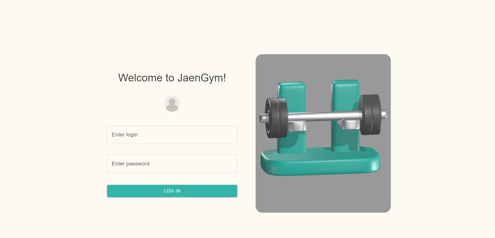
  
<em>Login page with user authentication form</em>

### User Interface

  Personal Statistics Dashboard

  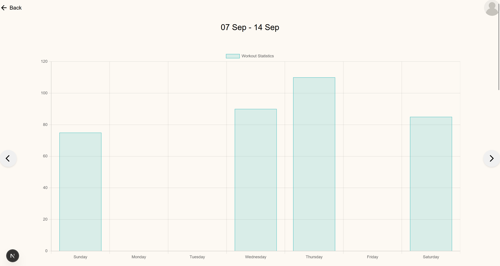
  
<em>Weekly training progress</em>

  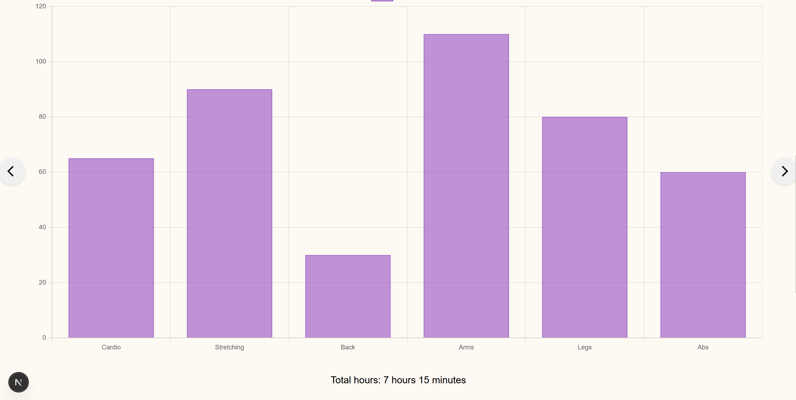
  
<em>Monthly training statistics</em>

  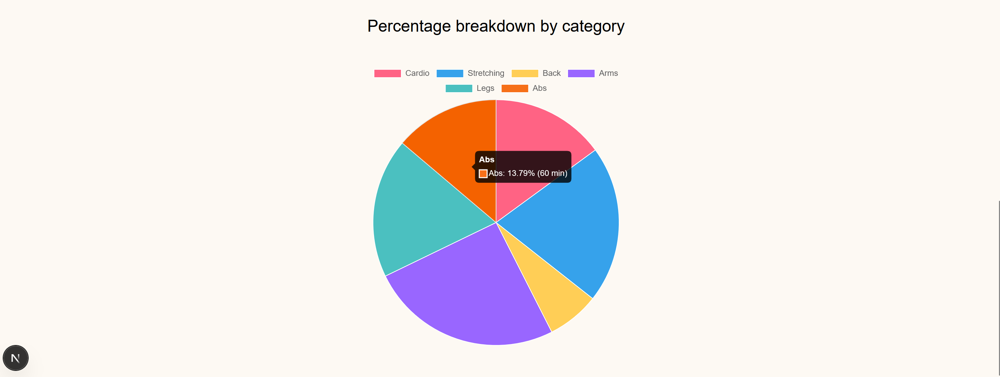
  
<em>Comprehensive all-time statistics by categories</em>

  Training Management

  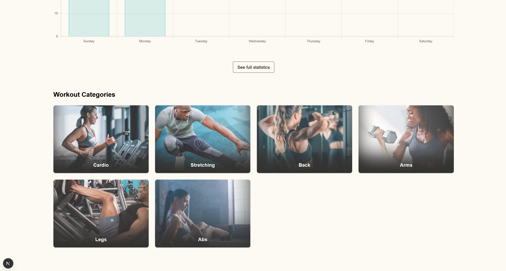
  
<em>Main user page displaying available exercise categories</em>

  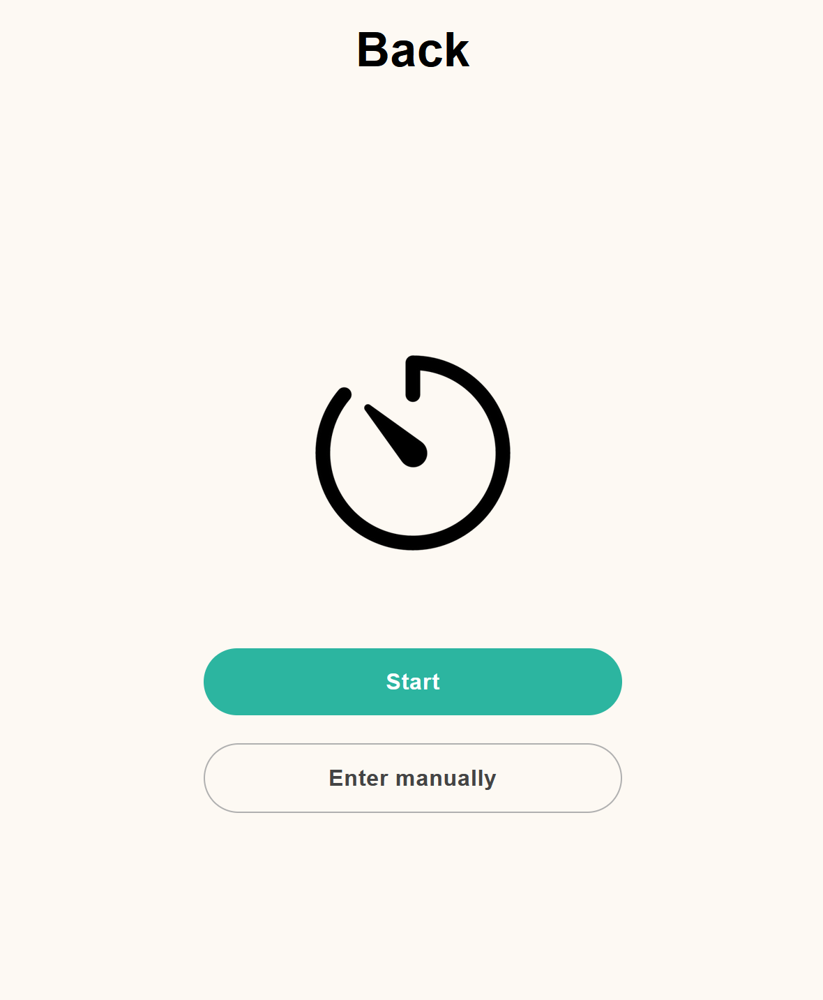
  
<em>Workout timer page</em>

  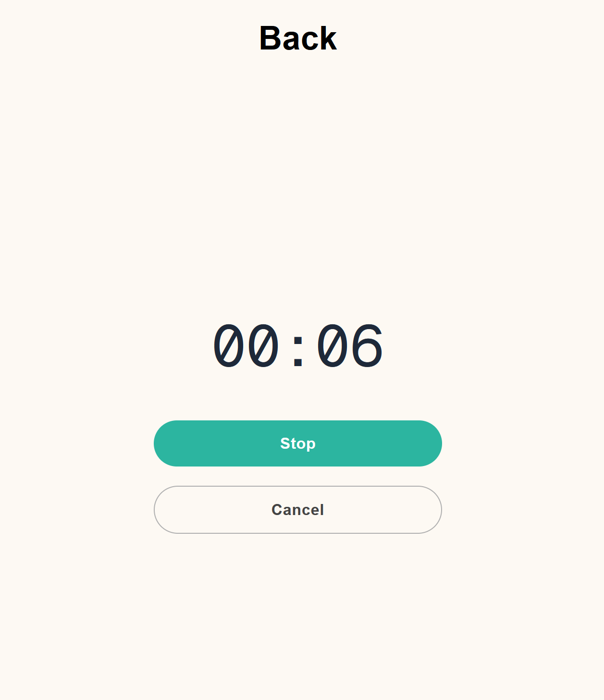
  
<em>Active training session with real-time timer</em>

  User Profile

  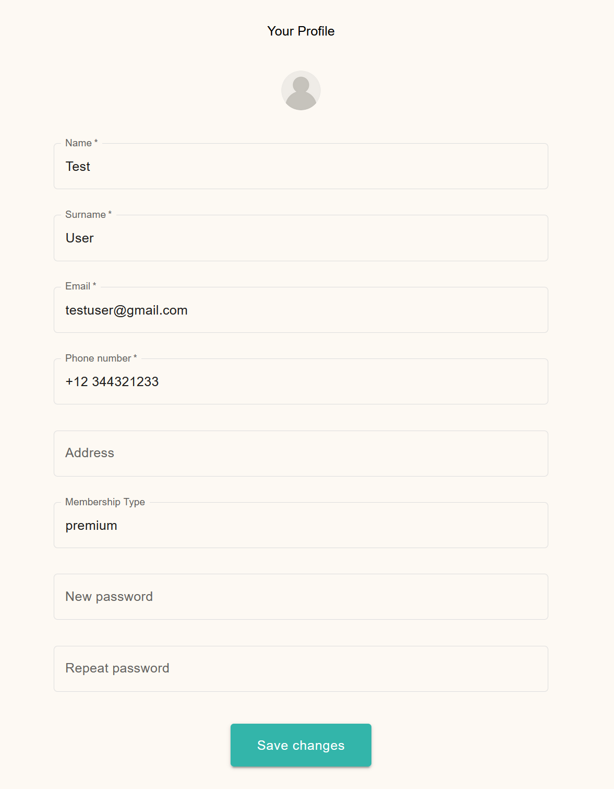
  
<em>Personal profile management and settings</em>

### Admin Interface

  Dashboard & User Management

  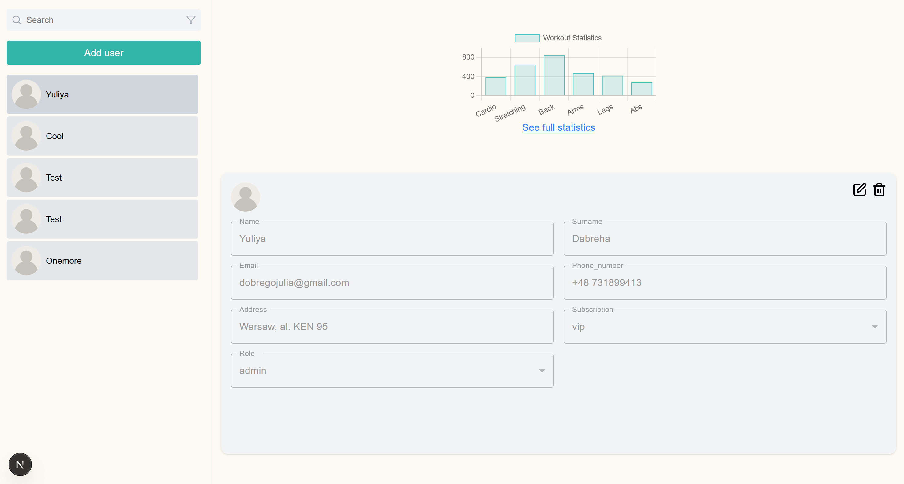
  
<em>Admin main dashboard with user management tools</em>

  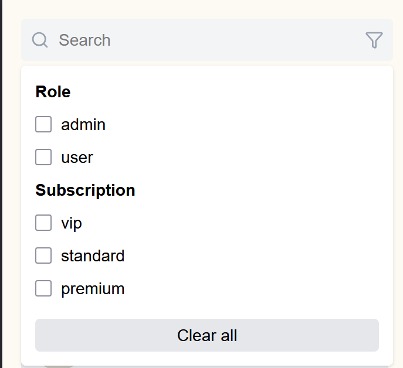
  
<em>Filters and seachbar</em>

  Analytics & Statistics

  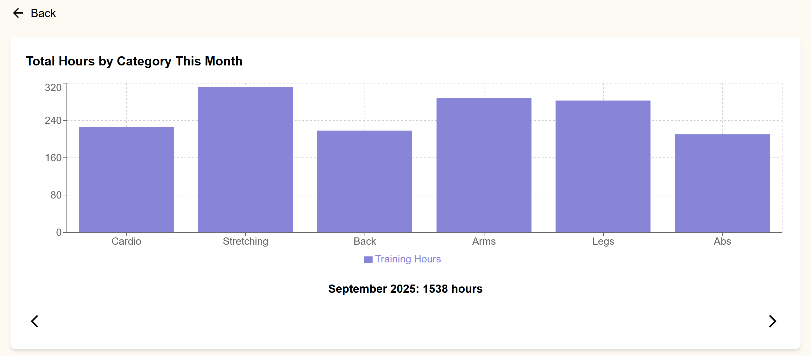
  
<em>Monthly gym activity analytics</em>

  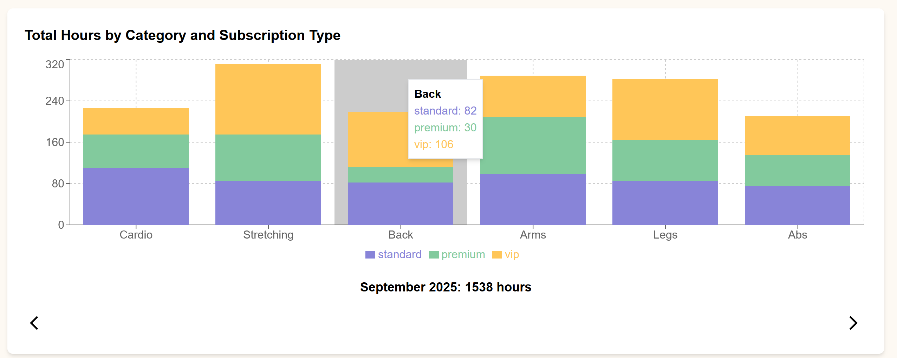
  
<em>Popular exercise categories and member engagement</em>

  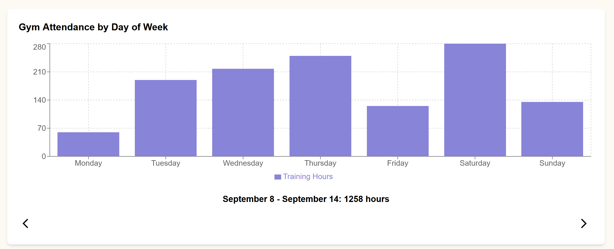
  
<em>Weekly gym activity trends </em>

